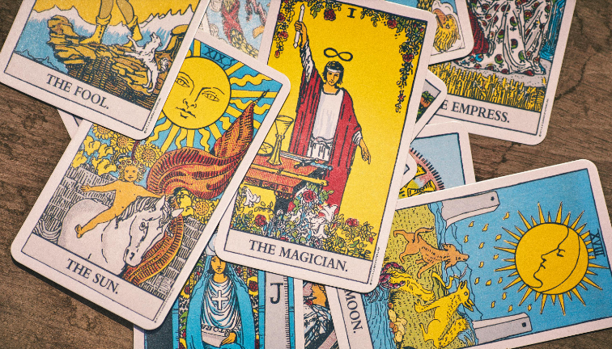

# Intuitive Trader Game

This repository is a placeholder for the code for **Stage 1 MVP** of a gamified platform designed to test and refine traders' intuition in financial predictions.

### Overview

The **Intuitive Trader Game** presents a novel approach to financial prediction: players predict market returns in the form of a card game, where each card corresponds to a potential return (high, insignificant, or negative). The goal is to investigate whether human intuition, when structured through gamification, can become a reliable tool for financial forecasting. If we gather enough data, we aim at benchmarking intuitive predictions at Numer.ai Crypto Contest.

In this **Stage 1 MVP**, we will focus on gathering initial data to assess whether any players can outperform random guessing, and whether patterns of consistent success can emerge.

*Guessing tarot cards sequence staged as an abstraction of real world trading.*

Read the White paper [Gamification of Financial Prediction: A Crowd-Sourced Experiment in Intuition](https://www.academia.edu/127714744/Gamification_of_Financial_Prediction_A_Crowd_Sourced_Experiment_in_Intuition)

### Key Features of the Paper

The idea behind the project is to:
- **Gamify Financial Prediction**: Participants are presented with sequences of obfuscated, abstracted historical market data and are asked to predict future returns by choosing the next "card" in a shuffled deck of several possible outcomes (targets).
- **Test Intuition-Based Predictions**: The game encourages intuitive decision-making (System 1 thinking) rather than analytical models or knowledge-based decisions.
- **Data-Driven Validation**: The predictions of successful players are aggregated and evaluated against machine learning models in financial modeling competitions like Numer.ai.
- **Stage 1 MVP Goal**: The first phase focuses on testing whether we can identify players who consistently perform above random chance, signaling that their intuition might have predictive value.

### **Test your own intuition**  
by participating in the game (once Stage 1 MVP is live)!

